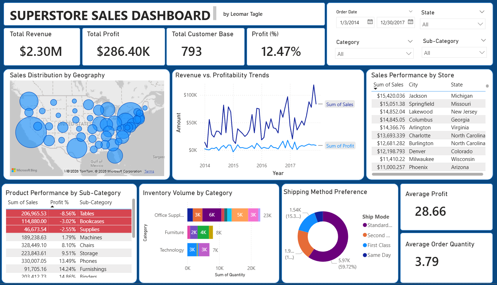

# Superstore_Sales_Dashboard
 Interactive Power BI dashboard analyzing $2.3M in retail sales data. Features include profitability tracking, Top-N filtering, and geographic distribution analysis for the "Cloud 9" Superstore.

 

## 📝 Project Overview
This project provides a comprehensive analysis of a global retail chain's performance (Cloud 9 Superstore). The goal was to transform raw transactional data into a dynamic, interactive dashboard that allows stakeholders to monitor key performance indicators (KPIs), identify regional trends, and pinpoint areas of financial loss.

## 🚀 Key Features & Insights
*   **Executive Summary:** At-a-glance tracking of Total Revenue ($2.30M), Total Profit ($286K), and Profit Margin (12.47%).
*   **Geographic Distribution:** An interactive bubble map visualizing sales density across the United States.
*   **Profitability Deep-Dive:** Used **Conditional Formatting** to highlight sub-categories with negative profit margins (Tables, Bookcases, and Supplies), providing immediate actionable insights for inventory management.
*   **Top 10 Analysis:** A filtered view of the highest-performing cities, led by New York City and Los Angeles.
*   **Shipping Optimization:** Analysis of shipping preferences showing that nearly 60% of customers utilize Standard Class shipping.

## 🛠️ Tools & Technical Skills
*   **Power BI:** Dashboard design, layout, and interactivity.
*   **DAX (Data Analysis Expressions):** Created custom measures for Profit Margin % and Total Customer Base.
*   **Data Transformation:** Cleaned and modeled the dataset to ensure accurate year-over-year trends.
*   **Data Visualization:** Implemented Top-N filtering, slicers for date/category, and custom tooltips.

## 📁 Repository Structure
*   `Superstore Sales Dashboard.pbix`: The interactive Power BI file.
*   `Superstore_Data.csv`: The raw dataset used for analysis.
*   `Screenshots/`: Folder containing dashboard images for quick preview.

## 💡 How to View
1. Download the `.pbix` file from this repository.
2. Open it using **Power BI Desktop**.
3. Use the slicers on the top-right to filter by Order Date, State, or Category to see how the data updates dynamically.

---
**Author:** Leomar Tagle  
**Connect with me on [LinkedIn](https://www.linkedin.com/in/leomartagle01/)**
